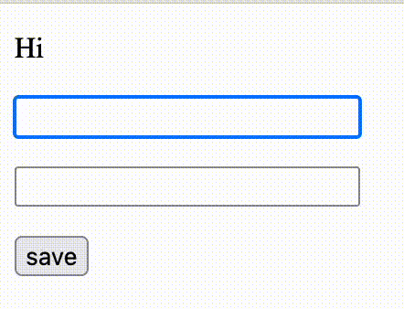

# Show me some code

Here's a demo of a small, simple form to edit and save a Person record.

(If you'd prefer, you can poke around a [demo Rails app](https://github.com/petekinnecom/interfacets-demo).)


### how it looks




### how it works

Interfacets runs MRuby in the browser using WASM. Part of your facet code is shipped off to the client and run in MRuby. The dom builder creates React components for you right from the comfort of ruby. Unbridled technology is what I'd call it.

When you want to make an API request, just use a `server_action`. Interfacets handles serializing, deserializing, api request, merging attributes, you know, the boring stuff. You just call a method. If that's not fun, then MAYBE YOU DON'T KNOW WHAT FUN IS. <sub>just saying</sub>

### the code

Here's everything you need to build a form. It's just a demo, but if you need a real form, I could get you a real form by 3 o'clock this afternoon... [with polish](https://www.youtube.com/watch?v=20wUS_bbOHY).

```ruby
class PersonFacet < ApplicationFacet
  view do |person|
    # Control the location bar
    render(:url) do |url|
      url.path("/person/#{person.id}")
    end

    # Render to react
    render(:dom) do |dom|
      dom.p("Hi #{person.full_name}")

      dom.p do
        dom.input(
          value: person.first_name,
          onChange: ->(value) { person.first_name = value }
        )
      end

      dom.p do
        dom.input(
          value: person.last_name,
          onChange: ->(value) { person.last_name = value }
        )
      end

      dom.button(
        "save",
        onClick: -> { person.save }
      )
    end
  end

  # Code specific to the frontend
  client do
    def full_name
      "#{first_name} #{last_name}"
    end
  end

  # Define your API
  shared do
    accessor(:id, accepted_by: :client)
    accessor(:first_name)
    accessor(:last_name)
    server_action(:save)
  end

  # Load the record on the backend.
  find do |id, query:|
    build(self, Person.find(id))
  end

  # Code specific to the backend
  server do
    # `record` here is that Person.find(id) object

    # All methods delegated to the record by default.
    # We'll list them out here for clarity:

    # delegate(
    #   :id,
    #   :first_name,
    #   :first_name=,
    #   :last_name,
    #   :last_name=,
    #   :save,
    #   to: :record
    # )
  end
end
```

### the end

That's it, we built the form. The `onClick: -> { person.save }` is all we need to persist it on the server. Neato!

- [Back to the README](../../README.md)
- [Read the tutorial](../tutorial/0-intro.md)
